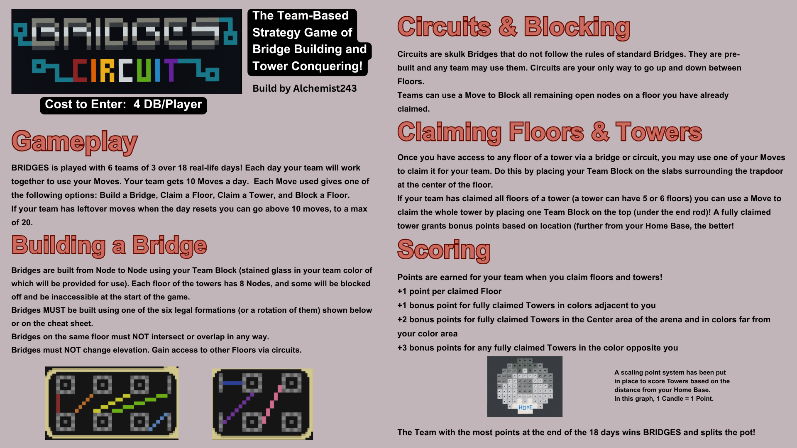
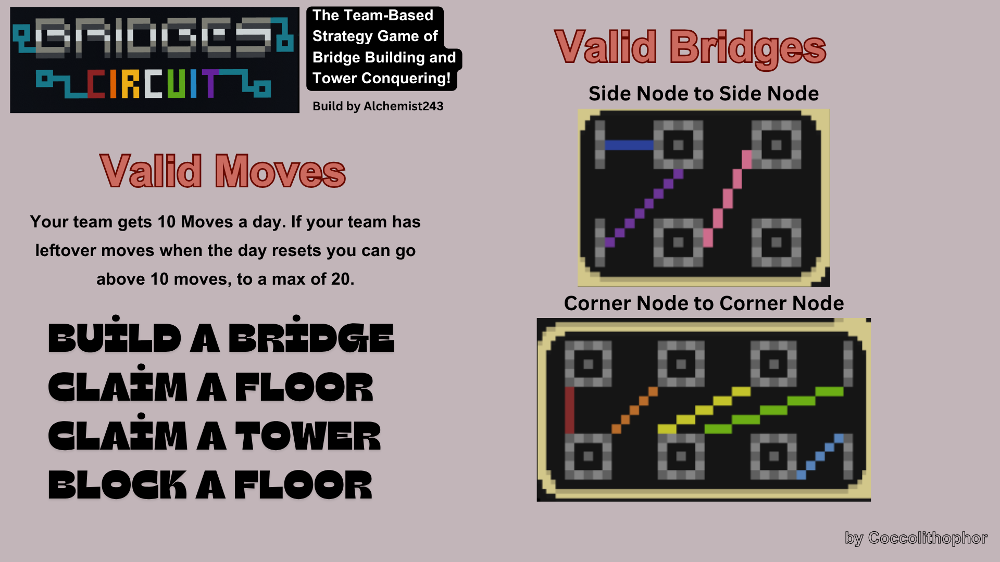

# BRIDGES - The Team-Based Strategy Game of Bridge Building and Tower Conquering!

Build by Alchemist243

## Cost to Enter
**4 DB/Player**

---

## Gameplay

BRIDGES is played with 6 teams of 3 over 18 real-life days! Each day your team will work towards building a bridge, claiming floors on towers, and more. Each Move used grants one of the following options:
- Build a Bridge
- Claim a Floor
- Claim a Tower
- Block a Floor

If your team has leftover moves when the day resets you can go above 10 moves in the next day.

---

## Building a Bridge

Bridges are built from Node to Node over Team Blocks obtained glass in your team color of which will be provided per use! Each floor of the towers has 3 Nodes, and some towers have a 4th Node accessible at the start of the game.

Bridges on the same floor must NOT intersect or overlap in any way. Bridges MUST be built using one of the six legal formations (or a rotation of them) shown below or on the rule sheet.

---

## Circuits & Blocking

Circuits are skull Bridges that do not follow the rules of standard Bridges. They are pre-built and any team may use them. Circuits are only available to go up and down between Floors.

Teams can use a Move to Block all remaining open nodes on a floor you have already claimed.

---

## Claiming Floors & Towers

Once you have access to any floor of a tower via a bridge or circuit, you may use one of your Moves to claim that floor for your team. Do this by placing your Team Block on the slabs surrounding the trapdoor at the center of the floor.

If your team has claimed all floors of a tower (a tower can have 5 or 6 Floors) you can use a Move to claim the whole tower by placing one Team Block on the trapdoor (and grab all claimed tower grants bonus points based on location (further from your Home Base, the better!))

---

## Scoring

Points are earned for your team when you claim floors and towers!

- **+1 point per claimed Floor**
- **+1 bonus point for fully claimed Towers in colors adjacent to you**
- **+2 bonus points for fully claimed Towers in the Center area of the arena and in colors for from your color area**
- **+3 bonus points for any fully claimed Towers in the color opposite you**

The Team with the most points at the end of the 18 days wins BRIDGES and splits the pot!

---

## Valid Moves

Your team gets 10 Moves a day. If your team has leftover moves when the day resets you can go above 10 moves in the next day.

**BUILD A BRIDGE**
**CLAIM A FLOOR**
**CLAIM A TOWER**
**BLOCK A FLOOR**

---

## Valid Bridges

Bridges must be built using one of the six legal formations. Bridges are validated by checking:

1. **Side Node to Side Node** configuration
2. **Corner Node to Corner Node** configuration

Refer to the bridge formation diagrams for the exact allowed patterns.

